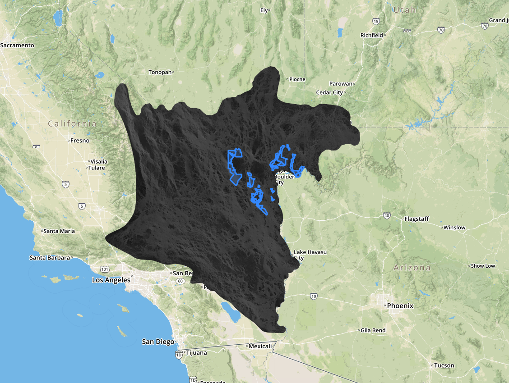

# CCI Coding Challenge

## Challenge description
### Part I
Create a single-page Django app that displays a map. The map will project an image (provided) as well as some polygons (also provided). The polygons will be projected on top of the image.

The final product should look similar to this:

* Note: The base layer does not matter. 

### Part II (Challenge)

You will find that the raster provided is made up of pixels with values between 0 and 1. 

The end goal is to allow a user to be able to click on any of the polygons (represented in blue in the demo picture above). When one of those polygons is clicked on, the user will see (up to you to decide how) the mean value of the raster's pixels located within the confines of the selected polygon. 

To get a better sense of what is being asked, click on the link below to see a similar app. To be clear, we are only interested in the user being able to view data from different parts of the raster when they click on a polygon covering a certain section of it. In other words, disregard any other functionality shown in the demo app. 

Similar app can be found [at this link](https://defendersofwildlifegis.users.earthengine.app/view/tortoisevalues).

## Logistics
* You will be added as a collaborator on a github repository after sharing your own email and/or github username.

* Once added, clone down this repository. Create a new git branch called `<your name>`.

* You will conduct all of your work in that branch. Store all of your work in a folder called `<your name>_work`

* When you have finished part I, email us at spatsel@defenders.org, and push up your changes to your branch. A CCI developer will then merge them to the master branch. 

* Once CCI has been notified that you've completed the first part, you may begin part II if you wish (not required). If you finish part II, notify us and push up the changes to your branch.

* Do not worry about deploying this app. A CCI developer will pull the changes down from the master branch and run the app locally.

## Required technologies  

### Languages
- Python 
- Javascript

### Frameworks
- [Django](https://www.djangoproject.com/)

### Libraries
- [Leaflet](https://leafletjs.com/reference-1.6.0.html)
- [Rasterio](https://rasterio.readthedocs.io/en/latest/) 

## Provided files
- ClarkGain.zip (shapefile)
- Gopherus_agassizii_connectivity.png (PNG used for map projection)
- Gopherus_agassizii_connectivity.tif (Raster used for extracting geospatial data)